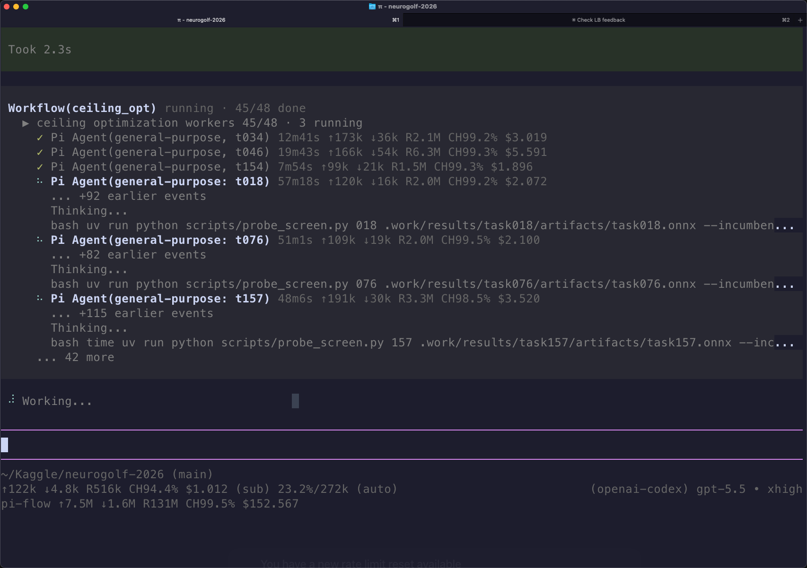

<div align="center">

# pi-flow

**Give Pi a team.**

Run focused subagents and multi-agent workflows across **Pi**, **Codex CLI**, and **Claude Code**—without leaving your Pi session.

[](https://github.com/kky42/pi-flow/actions/workflows/ci.yml)
[](https://www.npmjs.com/package/@kky42/pi-flow)
[](./LICENSE)

</div>



## One coordinator, many specialists

Pi stays in control while `pi-flow` gives it two new ways to delegate:

| Primitive | Best for |
| --- | --- |
| **`Agent`** | One focused task: explore a repository, review a diff, investigate a bug, or draft a solution. |
| **`workflow`** | Several independent tasks: parallel research, multi-model review, staged pipelines, and synthesized results. |

Each subagent can run through a different harness and model. Route fast searches to Codex, UI review to Claude Code, local analysis to Pi—or define your own mix.

```text
                              your request
                                   │
                                   ▼
                          ┌─────────────────┐
                          │ Pi coordinator  │
                          └────────┬────────┘
                                   │ Agent / workflow
                ┌──────────────────┼──────────────────┐
                ▼                  ▼                  ▼
        ┌──────────────┐   ┌──────────────┐   ┌──────────────┐
        │ Pi subagent  │   │ Codex CLI    │   │ Claude Code  │
        │ local tools  │   │ codex exec   │   │ claude -p    │
        └──────┬───────┘   └──────┬───────┘   └──────┬───────┘
               └──────────────────┼──────────────────┘
                                  ▼
                         synthesis back in Pi
```

## Get started in 30 seconds

Install the package:

```bash
pi install npm:@kky42/pi-flow
```

Then ask Pi to delegate naturally:

```text
Use a subagent to map this repository without changing files, then summarize the important entry points.
```

Or ask for a wider workflow:

```text
Review this PR from three independent angles—correctness, security, and test coverage—and synthesize the findings.
```

Pi decides how to invoke `Agent` or `workflow`, shows live progress, and returns the combined result in the same conversation.

## Why pi-flow?

- **Use the right model for each lane.** A single task can combine different models, harnesses, prompts, and toolsets.
- **Work in parallel.** Fan out repository exploration, research, review, or migration analysis while keeping one coordinator.
- **Keep delegation visible.** Pi's TUI shows queued and running agents, recent activity, duration, tokens, cache hits, and cost when available.
- **Continue a specialist when needed.** A caller-chosen `session_key` resumes the same backend conversation for review-and-revise loops.
- **Reuse successful orchestration.** Save trusted workflows globally or per project and invoke them later by name.
- **Stay harness-native.** Pi children use Pi tools; Codex and Claude children use their own CLI capabilities.

## Define your agent team

`pi-flow` includes one profile, `general-purpose`. Add specialists as Markdown files under:

```text
~/.pi/agent/subagents/<name>.md
```

The filename becomes the `subagent_type`. A profile chooses the backend, model, thinking level, tools, and role prompt.

### Pi specialist

```md
---
description: Fast read-only repository explorer.
backend: pi
tools: read, grep, find, ls
model: inherit
thinking: high
---

Map the repository without modifying files. Return concise findings with paths and symbols.
```

### Codex specialist

```md
---
description: Reviews implementation changes for correctness and missed edge cases.
backend: codex
model: gpt-5.5
thinking: high
---

Review the current diff. Lead with concrete findings and identify missing tests.
```

### Claude Code specialist

```md
---
description: Reviews frontend work for UX, accessibility, and visual quality.
backend: claude
model: sonnet
thinking: high
---

Inspect the frontend changes and recommend specific, high-impact improvements.
```

### Profile fields

| Field | Meaning |
| --- | --- |
| `description` | Required routing guidance shown to the Pi coordinator. |
| `backend` | `pi` (default), `codex`, or `claude`. |
| `model` | Optional backend model; omit or use `inherit` for Pi inheritance. |
| `thinking` | Optional backend-supported thinking level. |
| `tools` | Pi backend only: child-session tool allowlist. |
| Markdown body | Additional role and behavior instructions for the specialist. |

## Use a focused subagent

A fresh call starts a clean child conversation in the same working directory. Parent messages and tool results are not copied, so Pi sends a self-contained task.

```ts
Agent({
  description: "Map the authentication flow",
  subagent_type: "explorer",
  prompt: "Trace login from the HTTP entry point to session creation. Do not edit files.",
});
```

For follow-up work, reuse a stable `session_key`:

```ts
Agent({
  description: "Draft the migration",
  subagent_type: "implementation-expert",
  session_key: "auth-migration",
  prompt: "Propose a migration plan based on the current implementation.",
});

Agent({
  description: "Revise the migration",
  subagent_type: "implementation-expert",
  session_key: "auth-migration",
  prompt: "Revise the plan using the review feedback. Address rollback and compatibility.",
});
```

`pi-flow` maps that key to the backend-native session or thread and keeps the continuation explicit.

## Fan out with workflows

Use `workflow` when several lanes can run independently or when work benefits from multiple perspectives.

```text
Run a workflow that asks one agent to inspect the API, one to inspect persistence, and one to inspect tests. Synthesize the highest-risk gaps.
```

You usually do not need to write workflow code yourself. Pi can generate and run a small trusted JavaScript workflow, then present the result.

Ask Pi to save repeatable orchestration:

```text
Create a reusable release-readiness workflow, save it, and run it on this repository.
```

Saved workflows live in:

- `~/.pi/agent/workflows/*.js` for global workflows
- `.pi/workflows/*.js` for workflows in trusted projects

Inline workflows can also be resumed by replay: unchanged earlier agent calls reuse their journaled results, while changed or new calls run live.

## Built for real work

| Behavior | What it means |
| --- | --- |
| **Foreground execution** | `Agent` and `workflow` return only after delegated work completes; there is no hidden background job or polling system. |
| **Bounded concurrency** | Direct agents and workflow agents share one global concurrency limit; excess work queues visibly. |
| **Profile-based routing** | Backend, model, thinking, prompt, and Pi tool access are selected by named profiles—not hidden per-call overrides. |
| **Cancellation and timeouts** | Aborts propagate to child processes, and a global timeout prevents stalled subagents from running forever. |
| **Usage visibility** | Completed rows expose duration, input/output tokens, cache reads/writes, cache-hit rate, and known or estimated cost. |
| **Inspectable workflows** | Saved and generated workflows are ordinary JavaScript files with journals, rather than opaque orchestration state. |

Tune runtime guardrails when needed:

```bash
pi --max-concurrent-subagents 4 --subagent-timeout-ms 600000
```

Set `--subagent-timeout-ms 0` to disable the timeout.

## Trust and safety

`pi-flow` is designed for trusted development environments:

- Codex profiles run `codex exec` with approvals and sandboxing bypassed.
- Claude profiles run `claude -p` with permission checks bypassed.
- Workflow scripts are trusted local code executed by the Pi process; determinism checks are not a security sandbox.
- Pi-backed children cannot launch nested Pi agents or workflows. External CLIs keep their own native tool surface.

Review third-party profiles and workflows before using them, and run external backends only in repositories you trust.

## Requirements

- A working [Pi](https://github.com/earendil-works/pi) installation
- [Codex CLI](https://github.com/openai/codex) installed and authenticated for `backend: codex`
- [Claude Code](https://docs.anthropic.com/en/docs/claude-code) installed and authenticated for `backend: claude`

Only install the external CLIs you plan to use; Pi-backed subagents work without them.

## License

[MIT](./LICENSE)
