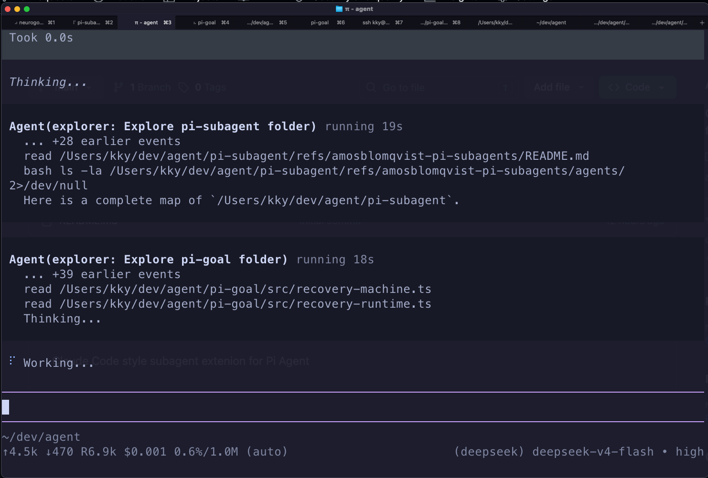

# pi-subagents

Claude Code-style subagents for pi: delegate repo exploration, broad code search, and independent reviews to fresh child agents — plus dynamic `workflow`s that fan work out across many subagents and synthesize the results.

```bash
pi install npm:@kky42/pi-subagents
```



## Pi Subagents vs. Claude Code Subagents

`pi-subagents` brings the same subagent shape to pi: an `Agent` tool with `description`, `prompt`, and optional `subagent_type`.

Available built-in agents:

- `general-purpose`: general agent for complex questions, code search, and multi-step investigations.
- `explorer`: fast read-only search agent for repo maps, file discovery, references, and concise findings.

Built-ins use the same markdown profile style as custom agents and are bundled under `src/subagents/`. Custom agents can be added as `~/.pi/agent/subagents/<agent-name>.md`. Fresh subagents start with their own conversation and the same working directory. The parent gets the final subagent report back as a tool result, then synthesizes the answer for the user.

Recent comparison run:

✅ means the main agent proactively invoked a root subagent for that scenario. ❌ means no root subagent invocation was observed before completion or the tool-call cap. Both harnesses used DeepSeek V4 Pro: pi ran `deepseek/deepseek-v4-pro` with `--thinking high`; Claude Code `2.1.170` was invoked with `--model sonnet --effort high` against DeepSeek's Anthropic-compatible endpoint, resolving to `deepseek-v4-pro[1m]`.

| Scenario | Size | Claude Code 2.1.170 deepseek-v4-pro[1m] | pi deepseek/deepseek-v4-pro |
| --- | --- | --- | --- |
| Exploration | small, 3 files | ❌ | ✅ |
| Exploration | medium, 34 files | ❌ | ✅ |
| Exploration | large, 213 files | ❌ | ✅ |
| Exploration | huge, 703 files | ❌ | ✅ |
| Understanding / QA | small, 3 files | ❌ | ✅ |
| Understanding / QA | medium, 34 files | ❌ | ❌ |
| Understanding / QA | large, 213 files | ✅ | ✅ |
| Understanding / QA | huge, 703 files | ✅ | ❌ |
| Implementation | small, 3 files | ❌ | ✅ |
| Implementation | medium, 34 files | ❌ | ❌ |
| Implementation | large, 213 files | ❌ | ❌ |
| Implementation | huge, 703 files | ❌ | ✅ |

This table measures only the routing decision: whether the main agent chose to invoke a subagent. It does not score answer quality or task completion. The e2e runner writes a fresh report under the OS temp directory for each run.

## Example

Ask pi:

```text
explore this repo
```

The main agent can launch:

```ts
Agent({
  description: "Explore repo structure",
  subagent_type: "explorer",
  prompt: "Map the project purpose, key directories, important files, scripts, tests, and caveats. Do not edit files."
})
```

The explorer returns a concise repo map, and the main agent relays the useful parts.

## Workflows

For fan-out work — codebase audits, multi-perspective review, broad research — ask pi for a *workflow*. The model can either write a small trusted JavaScript script inline or reuse a saved workflow from disk. The `workflow` tool runs the script, fans work out across isolated subagents, and synthesizes the results.

```text
Run a workflow to audit this repo for TODOs, FIXMEs, and skipped tests, then summarize.
```

Saved workflows live in:

- `~/.pi/agent/workflows/*.js` for global workflows
- `.pi/workflows/*.js` for project-local workflows, loaded only when the project is trusted

Each file starts with `export const meta = { name, description }`; put both the summary and “when to use” guidance in `description`. The model sees a compact roster of saved workflow names/descriptions and can call `workflow({ name, args })` when one matches the user's natural-language request. Project workflows override global workflows with the same `meta.name`.

Inline workflow runs are auto-persisted under the current session's workflow directory when the session is persisted. Persisted inline runs include `scriptPath` and `runId`, so an agent can edit that file and rerun with `workflow({ scriptPath, resumeFromRunId })`; in-memory runs may only include `runId`. Resume reuses cached `agent()` results for the longest unchanged prefix; the first edited/new `agent()` call and everything after it runs live.

The script runs in an isolated worker/VM so pi can detect stalls and abort unresponsive scripts, but it is **not a security sandbox**. Initial synchronous execution is bounded (5s by default), and post-`await` event-loop stalls are caught by a heartbeat watchdog. Treat saved workflows like trusted extensions, and treat inline workflows as model-written code executed in-process. The workflow globals are:

- `agent(prompt, opts)` — spawn one subagent; returns its final text, or a schema-validated object when `opts.schema` is set. `opts`: `label`, `phase`, `subagent_type`, `schema`.
- `parallel(thunks)` — run independent `() => agent(...)` thunks concurrently; results come back in input order.
- `pipeline(items, ...stages)` — run each item through the stages in order while different items run concurrently; each stage gets `(previousValue, originalItem, index)`.
- `phase(title)`, `log(message)`, `args` (the optional JSON passed to the tool), and `cwd`.

Workflow scripts must call `agent()` at least once and return a JSON-serializable value; return a summary string/object, or `null` when there is intentionally no synthesized result. Results are canonicalized to JSON: `undefined` object fields are omitted, non-finite numbers become `null`, and non-plain objects such as `Map`, `Set`, and `BigInt` are rejected.

The model writes and runs something like:

```ts
export const meta = { name: "audit", description: "find and summarize tech debt" };
const lanes = ["TODO", "FIXME", "skipped tests"];
const findings = await parallel(
  lanes.map((lane) => () =>
    agent(`Find every ${lane} in this repo. Report file:line.`, {
      subagent_type: "explorer",
      label: `find ${lane}`,
    }),
  ),
);
return await agent(`Summarize these findings:\n${findings.join("\n\n")}`, { label: "synthesize" });
```

Key properties:

- **Reusable.** Save trusted workflow scripts on disk and invoke them by `meta.name`; ad-hoc inline scripts still work and return a session `scriptPath` when the session is persisted.
- **Trust-gated.** Project-local `.pi/workflows` are ignored unless the project is trusted, and saved workflow files are re-parsed and path-checked before execution.
- **Real subagents.** Each `agent()` runs through the same spawn path as the `Agent` tool, so `subagent_type` gives it that profile's configured backend, model, thinking level, prompt, and pi-backend tool allowlist.
- **Structured output.** Pass a JSON Schema as `opts.schema` and `agent()` returns the first validated object instead of text — ideal for composing results in `parallel`/`pipeline`. Pi-backed subagents use an injected terminating `structured_output` tool; Codex-backed subagents use Codex CLI `--output-schema`; Claude-backed subagents use Claude Code `--json-schema`.
- **Cooperative determinism.** Date APIs and `Math.random()` uses, including simple aliases/destructuring, are rejected to keep normal model-written scripts replayable. This is a lint-style check for trusted code, not a sandbox against malicious JavaScript.
- **Resumable.** Use the returned `runId` with an edited `scriptPath` to reuse cached subagent outputs for the unchanged prefix of `agent()` calls.
- **Bounded.** Workflow fan-out shares the same global concurrency cap as the `Agent` tool; excess agents queue and drain as slots free. A workflow also has a hard cap on total `agent()` calls, retained logs, and the orchestration worker heap (512MB old generation by default; this does not cap subagent/tool subprocess memory).
- **Foreground.** A workflow is a single blocking tool call. Pi-backed subagents do not receive `Agent` or `workflow`; external CLI backends use their own tool surface.

The `workflow` tool is on by default. Disable it for a subagents-only setup:

```ts
createSubagentExtension({ workflow: false });
```

## Custom Subagents

Define subagents as markdown files. Built-in definitions live in `src/subagents/general-purpose.md` and `src/subagents/explorer.md`; custom definitions live in `~/.pi/agent/subagents/`. The filename is the subagent name, so `~/.pi/agent/subagents/code-reviewer.md` is selected with `subagent_type: "code-reviewer"`.

```md
---
description: Reviews code changes for correctness and maintainability.
tools: read, grep, find, ls, bash
model: inherit
thinking: high
---

You are a careful code reviewer. Focus on correctness, tests, regressions, and maintainability.
```

Fields:

- `description` is required and is shown in the available-agent roster.
- `backend` is optional. Omit it or set `pi` for an in-process pi child session. Set `codex` to run the profile through `codex exec --json --sandbox workspace-write` in the same working directory. Set `claude` to run the profile through `claude -p --output-format stream-json --verbose --no-session-persistence --permission-mode acceptEdits` in the same working directory.
- `tools` is optional for `backend: pi`; omit it to keep the default child-session tools. When present, it must be a non-empty comma-separated string such as `tools: read, grep, find`; that list becomes the child-session tool allowlist. Tool names can target built-ins (`read`, `bash`, `edit`, `write`, `grep`, `find`, `ls`) and any custom or extension tools loaded into that child session. Unknown tool names are passed to pi, which may ignore them; `Agent` is always stripped from child sessions. External CLI profiles use their CLI's own tool/permission surface.
- `model` is optional; omit it or set `inherit` to use the caller's model for `backend: pi`, Codex CLI's configured default for `backend: codex`, or Claude Code's configured default for `backend: claude`. Pi-backed explicit values must use exact `provider/model-id` syntax. Codex- and Claude-backed explicit values are passed as bare CLI model values such as `gpt-5.4-mini`, `sonnet`, or a full Claude model name.
- `thinking` is optional; omit it or set `inherit` to use the caller's thinking level. For Codex-backed profiles, `off` is omitted, `xhigh` maps to `high`, and other levels are passed as `model_reasoning_effort`. For Claude-backed profiles, `off` is omitted, `minimal` maps to `low`, and other levels are passed as `--effort`.
- The markdown body is required. Pi-backed profiles append it to the child agent's system prompt; Codex-backed profiles pass it as Codex `developer_instructions`; Claude-backed profiles pass it as Claude Code `--append-system-prompt`.

Codex example:

```md
---
description: Reviews code changes through Codex CLI.
backend: codex
model: gpt-5.4-mini
thinking: high
---

You are a careful Codex code reviewer. Focus on correctness, tests, regressions, and maintainability.
```

Claude Code example:

```md
---
description: Reviews code changes through Claude Code.
backend: claude
model: sonnet
thinking: high
---

You are a careful Claude Code reviewer. Focus on correctness, tests, regressions, and maintainability.
```

Files are ignored when the filename is not a valid lowercase kebab-case agent name, the frontmatter is invalid, `description` is missing, `backend` is unknown, the body is empty, `model` is malformed, `tools` is missing a non-empty comma-separated value after the field is present, or `thinking` is not one of `off`, `minimal`, `low`, `medium`, `high`, or `xhigh`. Pi-backed profiles with syntactically valid but unavailable `model` values are not advertised in the active agent roster; external CLI model availability is checked by the target CLI at launch.

## Notes

- Pi-backed subagents do not receive `Agent` or `workflow`; the main agent coordinates follow-up delegation after each result returns. External CLI subagents use their CLI's own tool and permission surface.
- Root-level parallel delegation is supported and bounded by the extension.
- Pi-backed subagents inherit the caller's current model and thinking level unless a custom profile overrides `model` or `thinking`; external CLI subagents omit model flags by default and use the target CLI's configured default unless the profile sets `model`.
- Subagents do not inherit parent conversation messages or tool results, so prompts should be self-contained.
- The TUI footer shows cumulative child-agent usage under the `pi-subagents` status key, for example `pi-subagents ↑47k ↓3.5k R177k CH91.0% $0.429`. Codex-backed token usage is parsed from `codex exec --json`; costs are estimated for listed models (`gpt-5.5`, `gpt-5.4`, `gpt-5.4-mini`) and treated as unknown/zero for unlisted models. Claude-backed token usage and cost are parsed from Claude Code stream-json events when reported.
- `explorer` is prompted as read-only; its child session allows `bash` for read-only exploration and verification commands such as `rg` or test scripts, while pi permissions are still controlled by the active pi runtime.

## E2E

Run the main-agent behavior e2e matrix:

```bash
npm run e2e
```

This downloads fresh GitHub fixtures across four size buckets (`octocat/Spoon-Knife`, `chalk/chalk`, `expressjs/express`, and `vuejs/core` by default), runs fresh `pi -p` sessions with ambient skills, extensions, prompt templates, themes, and context files disabled, then records Claude Code-style routing scenarios. The default pi settings are `deepseek/deepseek-v4-flash` with `--thinking high`. For observational scenarios, the runner stops an agent process as soon as a root subagent invocation is detected, because that is enough to record the main-agent delegation decision. It also stops after `--max-tool-calls` root tool calls, defaulting to `50`, so direct runs stay bounded. For pi the subagent signal is the `Agent` tool; for Claude Code this can be `Agent`, `Task`, or an agent-named tool advertised in the stream `init` event, such as `Explore`.

- codebase exploration
- codebase understanding / QA
- small README implementation
- a `workflow` fan-out scenario (medium and large buckets; observational by default — INCONCLUSIVE if the model does not reach for the `workflow` tool, strict only under `-- --strict-observed`)
- small, medium, large, and huge fixture buckets

Run the workflow feature e2e smoke:

```bash
npm run e2e:workflow-features
```

This exercises workflow tool selection, real subagent fan-out, saved/resume behavior, structured output, abort/limit handling, and progress snapshots against fresh pi sessions.

Run external-backend smoke tests:

```bash
npm run e2e:codex-subagent
npm run e2e:claude-subagent
```

These create temporary custom profiles, force the root agent to call `Agent`, and verify a real Codex CLI or Claude Code child returns the expected token without modifying the fixture repository.

To compare the same scenarios against Claude Code:

```bash
npm run e2e:compare-claude
```

The Claude comparison uses `--model haiku --effort high` by default and does not set a Claude budget cap unless `--claude-max-budget-usd` is provided. If `DEEPSEEK_API_KEY` is exported or present in `.env`, the runner configures Claude Code with DeepSeek's Anthropic-compatible endpoint and maps `haiku` to `deepseek-v4-flash[1m]`; it also creates a temporary pi auth file for the same key. It writes a report under `/tmp`, logs each scenario, and prints a ✅/❌ `useSubagent` summary table. By default the Claude run keeps Claude Code's dynamic system prompt sections enabled so subagent routing guidance matches normal Claude Code behavior; add `-- --claude-exclude-dynamic-system-prompt-sections` only when you intentionally want Claude's prompt-cache mode. Add `-- --repeat 3` to repeat each task, `-- --max-tool-calls 20` to lower the direct-run cap, `-- --timeout-ms 120000 --claude-timeout-ms 120000` when you want explicit wall-clock limits, `-- --strict-observed` when incomplete observational scenarios should fail the command, or `-- --strict-claude` when Claude-side failures should fail the command.
